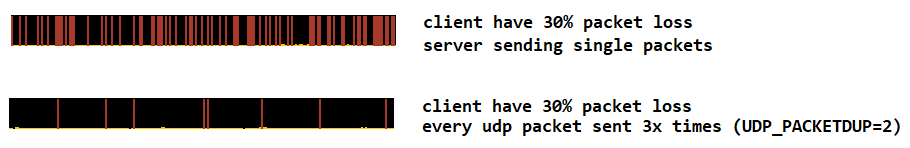

# udp_packetdup: repeat udp packets

An LD_PRELOAD trick that makes applications repeat UDP packets to mitigate packet loss.

# Compile

```
gcc -shared -fPIC -ldl udp_packetdup.c -o udp_packetdup.so
```

# Example: send 3 extra packets

1. set `UDP_PACKETDUP` env var to the number of extra packets to be sent
2. set `LD_PRELOAD` to the path of built `.so` file

```
UDP_PACKETDUP=3 LD_PRELOAD=$PWD/udp_packetdup.so COMMAND
```

# Reducing server -> client packet loss for Warfork

## Start command

```
UDP_PACKETDUP=2 LD_PRELOAD=$PWD/udp_packetdup.so ./wf_server.x86_64
```

## Visualization in Warfork netgraph
Each red spike is a lost server packet.


